<h1 align="center"><b>Hi!</b></h1>

- 🔭 I’m actively working on:
  - [**Vehemence RPG**](gamejolt.com/)
  - My Website, company, and other things...
- 🌱 I’m currently studying management
- 👯 I’m looking to work/collaborate on:
  - GameMaker projects
- 📫 How to reach me:
  - Discord: **knno** (Add me!)
  - Email: info@kenanmasri.com
  - Website: https://kenanmasri.com

 

---

## Notable Achievements

- One of the top 250 students of One Million Arab Coders.
- Made more than 12 video games on Windows and Android platform using GameMaker.
- Made 8 video games on Android platform alone.
- Made a few software programs for production, such as Fire Image Editor.
- More than 150,000 downloads of my Camera Mod for GTA San Andreas.
- 3LM language and its e3lm cli tool, hosted with GitHub and Python Package Index.
- ImGM (Implemented in *[GameMaker](https://gamemaker.io) by YoYo Games*)

### Favourite Fields

<table>
    <tr>
        <td>Cars (Automotive)</td><td></td>
    </tr>
    <tr>
        <td>Design, Art, Coding, Modelling</td><td></td>
    </tr>
    <tr>
        <td>Dentistry</td><td></td>
    </tr>
    <tr>
        <td>Engineering</td><td></td>
    </tr>
    <tr>
        <td>Gaming</td><td></td>
    </tr>
</table>

<table>
  <tr>
  <td></td>
  <td></td>
  <td></td>
  <td></td>
  <td></td>
  <td></td>
  <td></td>
  </tr>
  <tr>
  <td></td>
  <td></td>
  <td></td>
  <td></td>
  <td></td>
  <td></td>
  <td></td>
  </tr>
  <tr>
  <td></td>
  <td></td>
  <td></td>
  <td></td>
  <td colspan="3" align="center">Eager to learn more ^^</td>
  </tr>
</table>

---

## Special Thanks

- To the people and teams at GitHub, Microsoft, Udacity, and all companies I worked with.
- To my friends in discord, To GameMaker team, To developers who do their best.
- To Damascus University. and to my family and friends.

<!--
1) For sy.svg without colors:

    
▒▒▒▒▒▒▒▒▒▒　★　★　★　░░░░░░░░░░

2) Monospace font tests:

<pre align="center">
              ╷              
─━━━━┳━─  •   ┃   •  ─━┳━━━━─
     ┃        ┃        ┃     
     ┗━━━━━┙  ╵  ┕━━━━━┛     
</pre>

3) Original content from GitHub:

**knno/knno** is a ✨ _special_ ✨ repository because its `README.md` (this file) appears on your GitHub profile.

Here are some ideas to get you started:

- 🔭 I’m currently working on ...
- 🌱 I’m currently learning ...
- 👯 I’m looking to collaborate on ...
- 🤔 I’m looking for help with ...
- 💬 Ask me about ...
- 📫 How to reach me: ...
- 😄 Pronouns: ...
- ⚡ Fun fact: ...
-->
